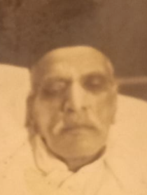

# Dedicated to the Dhanrajmal Balram Makhija and his Family

### Inspired by Smt. Santosh Nandlal Chawla

### Maintained by Rajesh Gobindram Makhija

#### Text in blue are links to help navigate the family tree

#### Apologies for any errors or omissions

#### Family members, please email update requests to:
#### dm_ft@outlook.com    

##### Last Updated: 10th October 2021

#  Dhanrajmal Balram Makhija

Self | Spouse
:--: | :----:
Dhanrajmal | Cheti 
 | 

Daughters | Sons
:-------: | :--:
[Veera](#Veera) | [Mohandas](#Mohandas)
[?](#?) | [Rupchand](#Rupchand)
        | [Lachmandas](#Lachmandas)

#  Generation 1

## [Dhanrajmal](#Dhanrajmal) ->  Veera

Self | Spouse
:--: | :----:
Veera | Fagoomal Asrani
 | 

Daughters | Sons
:-------: | :--:
 [Shagha](#Shagha) | [Lachmichand](#Lachmichand)
 | [Udhi](#Udhi)
 | [Bihari](#BihariV)
 | [Srichand (Siri)](#Siri)      

##### Go To [Generation 1](#Gen1)

## [Dhanrajmal](#Dhanrajmal) ->  ?

Self | Spouse
:--: | :----:
? | ? 
 | 

Daughters | Sons
:-------: | :--:
 [Gopi](#Gopi) | 
 
##### Go To [Generation 1](#Gen1)

## [Dhanrajmal](#Dhanrajmal) ->  Mohandas

Self | Spouse
:--: | :----:
Mohandas | Rukmanibai 
 | 

Daughters | Sons
:-------: | :--:
[Lila](#Lila) | [Ramchand](#Ramchand)
[Kaushalya](#Kaushalya) | [Kishin](#Kishin)
[Ganga](#Ganga) | [Gobindram](#Gobindram)
[Shanti](#Shanti) | [Hari](#Hari)
[Raju](#Raju) |      

##### Go To [Generation 1](#Gen1)

## [Dhanrajmal](#Dhanrajmal) ->  Rupchand

Self | Spouse
:--: | :----:
Rupchand | Laxmi 
 | 

Daughters | Sons
:-------: | :--:
[Lakhi](#Lakhi) | [Vashu](#Vashu)

##### Go To [Generation 1](#Gen1)

## [Dhanrajmal](#Dhanrajmal) ->  Lachmandas

Self | Spouse
:--: | :----:
Lachmandas | Janki 
 | 

Daughters | Sons
:-------: | :--:
[Sheela](#Sheela) | [Hiralal (Hiroo)](#Hiralal)
[Santosh](#Santosh) | 

##### Go To [Generation 1](#Gen1)

#  Generation 2

## [Dhanrajmal](#Dhanrajmal) -> [Veera](#Veera) ->  Shagha

Self | Spouse
:--: | :----:
Shagha | Atmaram 
 | 

Daughters | Sons
:-------: | :--:
[Baby](#BabyS) | [Dileep](#Dileep)
 | [Raja](#Raja)
 | [Anand](#Anand)

##### Go To [Generation 2](#Gen2)

## [Dhanrajmal](#Dhanrajmal) -> [Veera](#Veera) ->  Lachmichand

Self | Spouse
:--: | :----:
Lachmichand | Janki 
 | 

Daughters | Sons
:-------: | :--:
[DaughterofLachmichand](#DaughterOfLachmichand) | 

##### Go To [Generation 2](#Gen2)

## [Dhanrajmal](#Dhanrajmal) -> [Veera](#Veera) ->  Udhi

Self | Spouse
:--: | :----:
Udhi | Peggy 
 | 

Daughters | Sons
:-------: | :--:
? | ?

##### Go To [Generation 2](#Gen2)

## [Dhanrajmal](#Dhanrajmal) -> [Veera](#Veera) ->  Bihari

Self | Spouse
:--: | :----:
Bihari | Vidya 
 | 

Daughters | Sons
:-------: | :--:
[Aarti](#Aarti) | [Prakash](#PrakashB)
[Archana](#Archana) | 

##### Go To [Generation 2](#Gen2)

## [Dhanrajmal](#Dhanrajmal) -> [Veera](#Veera) ->  Srichand (Siri)

Self | Spouse
:--: | :----:
Siri | Kamlesh 
 | 

Daughters | Sons
:-------: | :--:
[Resham](#Resham) | 
[Preethi](#Preethi) |
[Sabitha](#Sabitha) | 
[Upasana](#Upasana) | 

##### Go To [Generation 2](#Gen2)

## [Dhanrajmal](#Dhanrajmal) -> [?](#?) ->  Gopi

Self | Spouse
:--: | :----:
Gopi | ? 
 | 

Daughters | Sons
:-------: | :--:
? | ?

##### Go To [Generation 2](#Gen2)

## [Dhanrajmal](#Dhanrajmal) -> [Mohandas](#Mohandas) ->  Lila

Self | Spouse
:--: | :----:
Lila | Sugnichand Talreja 
 | 

Daughters | Sons
:-------: | :--:
[Kamla](#Kamla) | [Gopal](#Gopal)
[Hardevi](#Hardevi) | [Tulsidas (Laali)](#Tulsidas)
[Maya](#Maya) | [Lala](#Lala)
[Radha](#Radha) | [Moti](#Moti)
[Asha](#Asha) | [Balli](#Balli)

##### Go To [Generation 2](#Gen2)

## [Dhanrajmal](#Dhanrajmal) -> [Mohandas](#Mohandas) ->  Kaushalya

Self | Spouse
:--: | :----:
Kaushalya | Kanaiyalal Bajaj 
 | 

Daughters | Sons
:-------: | :--:
[Duru](#Duru) | [Amar](#Amar)
 | [Anil](#Anil)

##### Go To [Generation 2](#Gen2)

## [Dhanrajmal](#Dhanrajmal) -> [Mohandas](#Mohandas) ->  Ganga

Self | Spouse
:--: | :----:
Ganga | Menghraj Ahuja 
 | 

Daughters | Sons
:-------: | :--:
[Shanta](#Shanta) | 

##### Go To [Generation 2](#Gen2)

## [Dhanrajmal](#Dhanrajmal) -> [Mohandas](#Mohandas) ->  Shanti

Self | Spouse
:--: | :----:
Shanti | Parsram Shroff 
 | 

Daughters | Sons
:-------: | :--:
[Kamlesh](#Kamlesh) | [Arjun](#Arjun)
[Sweety](#Sweety) | [Haresh](#Haresh)

##### Go To [Generation 2](#Gen2)

## [Dhanrajmal](#Dhanrajmal) -> [Mohandas](#Mohandas) ->  Raju

Self | Spouse
:--: | :----:
Raju | Madanlal Jumani 
 | 

Daughters | Sons
:-------: | :--:
[Sindu](#Sindu) | 

##### Go To [Generation 2](#Gen2)

## [Dhanrajmal](#Dhanrajmal) -> [Mohandas](#Mohandas) ->  Ramchand

Self | Spouse
:--: | :----:
Ramchand | Gopi 
 | 

Daughters | Sons
:-------: | :--:
[Vindur](#Vindur) | [Girdhari](#Girdhari)
[Baby](#Baby) | [Bihari](#BihariR)

##### Go To [Generation 2](#Gen2)

## [Dhanrajmal](#Dhanrajmal) -> [Mohandas](#Mohandas) ->  Kishin

Self | Spouse
:--: | :----:
Kishin | Tara 
 | 

Daughters | Sons
:-------: | :--:
[Shakku](#Shakku) | [Deepak](#Deepak)
[Maya](#MayaK) | [Prakash](#PrakashK)
[Soni](#Soni) | 

##### Go To [Generation 2](#Gen2)

## [Dhanrajmal](#Dhanrajmal) -> [Mohandas](#Mohandas) ->  Gobindram

Self | Spouse
:--: | :----:
Gobindram | Kamla 
 | 

Daughters | Sons
:-------: | :--:
 | [Vishamber (Vishu)](#Vishu)
 | [Rajesh](#Rajesh)

##### Go To [Generation 2](#Gen2)

## [Dhanrajmal](#Dhanrajmal) -> [Mohandas](#Mohandas) ->  Hari

Self |
:--: |
Hari |
 |  
 
##### Go To [Generation 2](#Gen2)

## [Dhanrajmal](#Dhanrajmal) -> [Rupchand](#Rupchand) ->  Lakhi

Self | Spouse
:--: | :----:
Lakhi | Bhagwandas Ahuja 
 | 

Daughters | Sons
:-------: | :--:
 | [Bansi](#Bansi)

##### Go To [Generation 2](#Gen2)

## [Dhanrajmal](#Dhanrajmal) -> [Rupchand](#Rupchand) ->  Vashu

Self | Spouse
:--: | :----:
Vashu | Shanti 
 | 

Daughters | Sons
:-------: | :--:
 | [Srichand](#Srichand)
 | [Prakash](#PrakashV)

##### Go To [Generation 2](#Gen2)

## [Dhanrajmal](#Dhanrajmal) -> [Lachmandas](#Lachmandas) ->  Sheela

Self | Spouse
:--: | :----:
Sheela | Gopal Ramnarayan 
 | 

Daughters | Sons
:-------: | :--:
[Shalini](#Shalini) | [Jawahar](#Jawahar)
 | [Manohar (Manu)](#Manu)
 | [Dhiren](#Dhiren)

##### Go To [Generation 2](#Gen2)

## [Dhanrajmal](#Dhanrajmal) -> [Lachmandas](#Lachmandas) ->  Santosh

Self | Spouse
:--: | :----:
Santosh | Nandlal Chawla
 | 

Daughters | Sons
:-------: | :--:
[Sharmila](#Sharmila) | [Prakash](#PrakashN)
 | [Sunil](#Sunil)

##### Go To [Generation 2](#Gen2)

## [Dhanrajmal](#Dhanrajmal) -> [Lachmandas](#Lachmandas) ->  Hiroo

Self | Spouse
:--: | :----:
Hiroo | Shobha 
 | 

Daughters | Sons
:-------: | :--:
[Ritika](#Ritika) | [Manek](#Manek)
 | [Sharan](#Sharan)

##### Go To [Generation 2](#Gen2)

#  Generation 3

## [Dhanrajmal](#Dhanrajmal) -> [Veera](#Veera) -> [Shagha](#Shagha) ->  Baby

Self | Spouse
:--: | :----:
Baby | ? 
 | 

Daughters | Sons
:-------: | :--:
 | 

##### Go To [Generation 3](#Gen3)

## [Dhanrajmal](#Dhanrajmal) -> [Veera](#Veera) -> [Shagha](#Shagha) ->  Dileep

Self | Spouse
:--: | :----:
Dileep | ? 
 | 

Daughters | Sons
:-------: | :--:
 | 

##### Go To [Generation 3](#Gen3)

## [Dhanrajmal](#Dhanrajmal) -> [Veera](#Veera) -> [Shagha](#Shagha) ->  Raja

Self | Spouse
:--: | :----:
Raja | ? 
 | 

Daughters | Sons
:-------: | :--:
 | 

##### Go To [Generation 3](#Gen3)

## [Dhanrajmal](#Dhanrajmal) -> [Veera](#Veera) -> [Shagha](#Shagha) ->  Anand

Self | Spouse
:--: | :----:
Anand | ? 
 | 

Daughters | Sons
:-------: | :--:
 | 

##### Go To [Generation 3](#Gen3)

## [Dhanrajmal](#Dhanrajmal) -> [Veera](#Veera) -> [Lachmichand](#Lachmichand) ->  DaughterOfLachmichand

Self | Spouse
:--: | :----:
? | ? Asrani 
 | 

Daughters | Sons
:-------: | :--:
 | [Deepak](#DeepakL)

##### Go To [Generation 3](#Gen3)

## [Dhanrajmal](#Dhanrajmal) -> [Veera](#Veera) -> [Bihari](#BihariV) ->  Prakash

Self | Spouse
:--: | :----:
Prakash | Neeta
 | 

Daughters | Sons
:-------: | :--:
? | 
? |

##### Go To [Generation 3](#Gen3)

## [Dhanrajmal](#Dhanrajmal) -> [Veera](#Veera) -> [Bihari](#BihariV) ->  Aarti

Self | Spouse
:--: | :----:
Aarti | Shyam Bhatija
 | 

Daughters | Sons
:-------: | :--:
 | ?
 | ?

##### Go To [Generation 3](#Gen3)

## [Dhanrajmal](#Dhanrajmal) -> [Veera](#Veera) -> [Bihari](#BihariV) ->  Archana

Self | Spouse
:--: | :----:
Archana | ? Chitkara
 | 

Daughters | Sons
:-------: | :--:
 | ?

##### Go To [Generation 3](#Gen3)

## [Dhanrajmal](#Dhanrajmal) -> [Veera](#Veera) -> [Siri](#Siri) ->  Resham

Self | Spouse
:--: | :----:
Resham | Narayan Sadarangani
 | 

Daughters | Sons
:-------: | :--:
[Reena](#Renna) | [Prashant](#Prashant) 

##### Go To [Generation 3](#Gen3)

## [Dhanrajmal](#Dhanrajmal) -> [Veera](#Veera) -> [Siri](#Siri) ->  Preethi

Self | Spouse
:--: | :----:
Preethi | Kishore Luthria
 | 

Daughters | Sons
:-------: | :--:
[Sheena](#Sheena) | 
[Sonia](#Sonia) | 
[Karishma](#Karishma) | 

##### Go To [Generation 3](#Gen3)

## [Dhanrajmal](#Dhanrajmal) -> [Veera](#Veera) -> [Siri](#Siri) ->  Sabitha

Self |
:--: |
Sabitha |
 |

##### Go To [Generation 3](#Gen3)

## [Dhanrajmal](#Dhanrajmal) -> [Veera](#Veera) -> [Siri](#Siri) ->  Upasana

Self | Spouse
:--: | :----:
Upasana | Sameer Chhabria
 | [Sameer Img](images/Sameer.PNG)

Daughters | Sons
:-------: | :--:
 | [Amrit](#Amrit)

##### Go To [Generation 3](#Gen3)

## [Dhanrajmal](#Dhanrajmal) -> [Mohandas](#Mohandas) -> [Lila](#Lila) ->  Kamla

Self | Spouse
:--: | :----:
Kamla | ? 
 | 

Daughters | Sons
:-------: | :--:
 |

##### Go To [Generation 3](#Gen3)

## [Dhanrajmal](#Dhanrajmal) -> [Mohandas](#Mohandas) -> [Lila](#Lila) ->  Hardevi

Self | Spouse
:--: | :----:
Hardevi | ? 
 | 

Daughters | Sons
:-------: | :--:
 |

##### Go To [Generation 3](#Gen3)

## [Dhanrajmal](#Dhanrajmal) -> [Mohandas](#Mohandas) -> [Lila](#Lila) ->  Maya

Self | Spouse
:--: | :----:
Maya | ? 
 | 

Daughters | Sons
:-------: | :--:
 |

##### Go To [Generation 3](#Gen3)

## [Dhanrajmal](#Dhanrajmal) -> [Mohandas](#Mohandas) -> [Lila](#Lila) ->  Asha

Self | Spouse
:--: | :----:
Asha | ? 
 | 

Daughters | Sons
:-------: | :--:
 |

##### Go To [Generation 3](#Gen3)

## [Dhanrajmal](#Dhanrajmal) -> [Mohandas](#Mohandas) -> [Lila](#Lila) ->  Radha

Self | Spouse
:--: | :----:
Radha | ? 
 | 

Daughters | Sons
:-------: | :--:
 |

##### Go To [Generation 3](#Gen3)

## [Dhanrajmal](#Dhanrajmal) -> [Mohandas](#Mohandas) -> [Lila](#Lila) ->  Gopal Talreja

Self | Spouse
:--: | :----:
Gopal | Sukichana 
 | 

Daughters | Sons
:-------: | :--:
 |

##### Go To [Generation 3](#Gen3)

## [Dhanrajmal](#Dhanrajmal) -> [Mohandas](#Mohandas) -> [Lila](#Lila) ->  Balli Talreja

Self | Spouse
:--: | :----:
Balli | ? 
 | 

Daughters | Sons
:-------: | :--:
 |

##### Go To [Generation 3](#Gen3)

## [Dhanrajmal](#Dhanrajmal) -> [Mohandas](#Mohandas) -> [Lila](#Lila) ->  Tulsidas (Laali) Talreja

Self | Spouse
:--: | :----:
Tulsidas (Laali) | Nandini 
 | 

Daughters | Sons
:-------: | :--:
 |

##### Go To [Generation 3](#Gen3)

## [Dhanrajmal](#Dhanrajmal) -> [Mohandas](#Mohandas) -> [Lila](#Lila) ->  Lala Talreja

Self | Spouse
:--: | :----:
Lala | ? 
 | 

Daughters | Sons
:-------: | :--:
 |

##### Go To [Generation 3](#Gen3)

## [Dhanrajmal](#Dhanrajmal) -> [Mohandas](#Mohandas) -> [Lila](#Lila) ->  Moti Talreja

Self | Spouse
:--: | :----:
Moti | ? 
 | 

Daughters | Sons
:-------: | :--:
 |

##### Go To [Generation 3](#Gen3)

## [Dhanrajmal](#Dhanrajmal) -> [Mohandas](#Mohandas) -> [Kaushalya](#Kaushalya) ->  Duru

Self | Spouse
:--: | :----:
Duru | Prakash Nichani 
 | 

Daughters | Sons
:-------: | :--:
[Shweta](#Shweta) | [Sonu](#Sonu)
[Shilpa](#Shilpa) | 

##### Go To [Generation 3](#Gen3)

## [Dhanrajmal](#Dhanrajmal) -> [Mohandas](#Mohandas) -> [Kaushalya](#Kaushalya) ->  Amar Bajaj

Self | Spouse
:--: | :----:
Amar | Anu 
 | 

Daughters | Sons
:-------: | :--:
 | [Nilesh](#Nilesh)
 | [Jayesh](#Jayesh) 

##### Go To [Generation 3](#Gen3)

## [Dhanrajmal](#Dhanrajmal) -> [Mohandas](#Mohandas) -> [Kaushalya](#Kaushalya) ->  Anil Bajaj

Self | Spouse
:--: | :----:
Anil | Kritika 
 | 

Daughters | Sons
:-------: | :--:
 [Anshi](#Anshi) |

##### Go To [Generation 3](#Gen3)

## [Dhanrajmal](#Dhanrajmal) -> [Mohandas](#Mohandas) -> [Ganga](#Ganga) ->  Shanta

Self | Spouse
:--: | :----:
Shanta | Gopal 
 | 

Daughters | Sons
:-------: | :--:
 [Pooja](#Pooja) | [Nitesh](#Nitesh) 

##### Go To [Generation 3](#Gen3)

## [Dhanrajmal](#Dhanrajmal) -> [Mohandas](#Mohandas) -> [Shanti](#Shanti) ->  Kamlesh

Self | Spouse
:--: | :----:
Kamlesh | Dilip Kalro
 | 

Daughters | Sons
:-------: | :--:
 [Sneha](#Sneha) | 
 [Seema](#Seema) | 

##### Go To [Generation 3](#Gen3)

## [Dhanrajmal](#Dhanrajmal) -> [Mohandas](#Mohandas) -> [Shanti](#Shanti) ->  Sweety

Self | Spouse
:--: | :----:
Sweety | Kumar Dedhia
 | 

Daughters | Sons
:-------: | :--:
 [Jaitali](#Jaitali) | 
 [Shivani](#Shivani) | 

##### Go To [Generation 3](#Gen3)

## [Dhanrajmal](#Dhanrajmal) -> [Mohandas](#Mohandas) -> [Shanti](#Shanti) ->  Arjun Shroff

Self | Spouse
:--: | :----:
Arjun | Emma
 | 

Daughters | Sons
:-------: | :--:
 [Sheena](#Sheena) | 
 [Kristine](#Kristine) | 

##### Go To [Generation 3](#Gen3)

## [Dhanrajmal](#Dhanrajmal) -> [Mohandas](#Mohandas) -> [Shanti](#Shanti) ->  Haresh Shroff

Self | Spouse
:--: | :----:
Haresh | Tanya
 | 

Daughters | Sons
:-------: | :--:
 [Yashika](#Yashika) | [Garv](#Garv)
 
##### Go To [Generation 3](#Gen3)

## [Dhanrajmal](#Dhanrajmal) -> [Mohandas](#Mohandas) -> [Raju](#Raju) ->  Sindu

Self | Spouse
:--: | :----:
Sindu | Manoj Khatwani
 | 

Daughters | Sons
:-------: | :--:
 [Marvi](#Marvi) | 
 [Nikita](#Nikita) | 

##### Go To [Generation 3](#Gen3)

## [Dhanrajmal](#Dhanrajmal) -> [Mohandas](#Mohandas) -> [Ramchand](#Ramchand) ->  Vindur

Self | Spouse
:--: | :----:
Vindur | Thakurdas Bathija
 | 

Daughters | Sons
:-------: | :--:
 [Komal](#Komal) | 
 [Leenu](#Leenu) | 

##### Go To [Generation 3](#Gen3)

## [Dhanrajmal](#Dhanrajmal) -> [Mohandas](#Mohandas) -> [Ramchand](#Ramchand) ->  Baby (Vimla)

Self | Spouse
:--: | :----:
Baby | Prakash Talreja
 | 

Daughters | Sons
:-------: | :--:
 [Jyoti](#Jyoti) | [Nitin](#Nitin)

##### Go To [Generation 3](#Gen3)

## [Dhanrajmal](#Dhanrajmal) -> [Mohandas](#Mohandas) -> [Ramchand](#Ramchand) ->  Girdhari

Self | Spouse
:--: | :----:
Girdhari | Ratna
 | 

Daughters | Sons
:-------: | :--:
 [Shital](#Shital) | [Ashish](#Ashish)

##### Go To [Generation 3](#Gen3)

## [Dhanrajmal](#Dhanrajmal) -> [Mohandas](#Mohandas) -> [Ramchand](#Ramchand) ->  Bihari

Self | Spouse
:--: | :----:
Bihari | Meena
 | 

Daughters | Sons
:-------: | :--:
 [Sneha](#SnehaB) | 

##### Go To [Generation 3](#Gen3)

## [Dhanrajmal](#Dhanrajmal) -> [Mohandas](#Mohandas) -> [Kishin](#Kishin) ->  Shakku

Self | Spouse
:--: | :----:
Shakku | ?
 | 

Daughters | Sons
:-------: | :--:
 | 

##### Go To [Generation 3](#Gen3)

## [Dhanrajmal](#Dhanrajmal) -> [Mohandas](#Mohandas) -> [Kishin](#Kishin) ->  Maya

Self | Spouse
:--: | :----:
Maya | ?
 | 

Daughters | Sons
:-------: | :--:
 | 

##### Go To [Generation 3](#Gen3)

## [Dhanrajmal](#Dhanrajmal) -> [Mohandas](#Mohandas) -> [Kishin](#Kishin) ->  Soni

Self | Spouse
:--: | :----:
Soni | ?
 | 

Daughters | Sons
:-------: | :--:
 | 

##### Go To [Generation 3](#Gen3)

## [Dhanrajmal](#Dhanrajmal) -> [Mohandas](#Mohandas) -> [Kishin](#Kishin) ->  Deepak

Self | Spouse
:--: | :----:
Deepak | Jyoti
 | 

Daughters | Sons
:-------: | :--:
 | 

##### Go To [Generation 3](#Gen3)

## [Dhanrajmal](#Dhanrajmal) -> [Mohandas](#Mohandas) -> [Kishin](#Kishin) ->  Prakash

Self | Spouse
:--: | :----:
Prakash | ?
 | 

Daughters | Sons
:-------: | :--:
 | 

##### Go To [Generation 3](#Gen3)

## [Dhanrajmal](#Dhanrajmal) -> [Mohandas](#Mohandas) -> [Gobindram](#Gobindram) ->  Vishu (Vishamber)

Self | Spouse
:--: | :----:
Vishu | Neelu
 | 

Daughters | Sons
:-------: | :--:
 | [Karan](#Karan) 

##### Go To [Generation 3](#Gen3)

## [Dhanrajmal](#Dhanrajmal) -> [Mohandas](#Mohandas) -> [Gobindram](#Gobindram) ->  Rajesh

Self | Spouse
:--: | :----:
Rajesh | Shashi
 | 

Daughters | Sons
:-------: | :--:
 [Neha](#Neha) | 

##### Go To [Generation 3](#Gen3)

## [Dhanrajmal](#Dhanrajmal) -> [Rupchand](#Rupchand) -> [Lakhi](#Lakhi) ->  Bansi

Self | Spouse
:--: | :----:
Bansi | Manju
 | 

Daughters | Sons
:-------: | :--:
 | [Vijay](#Vijay)
 | [Madan](#Madan)

##### Go To [Generation 3](#Gen3)

## [Dhanrajmal](#Dhanrajmal) -> [Rupchand](#Rupchand) -> [Vashu](#Vashu) ->  Srichand

Self | Spouse
:--: | :----:
Srichand | Veena
 | 

Daughters | Sons
:-------: | :--:
 | [Sharan](#SharanS)

##### Go To [Generation 3](#Gen3)

## [Dhanrajmal](#Dhanrajmal) -> [Rupchand](#Rupchand) -> [Vashu](#Vashu) ->  Prakash

Self | Spouse
:--: | :----:
Prakash | Rita
 | 

Daughters | Sons
:-------: | :--:
[Priti](#Priti) | [Krishna](#Krishna)

##### Go To [Generation 3](#Gen3)

## [Dhanrajmal](#Dhanrajmal) -> [Lachmandas](#Lachmandas) -> [Sheela](#Sheela) ->  Shalini

Self | Spouse
:--: | :----:
Shalini | Mahesh Makhija
 | 

Daughters | Sons
:-------: | :--:
 | [Vivek](#Vivek)
 | [Vinod](#Vinod)

##### Go To [Generation 3](#Gen3)

## [Dhanrajmal](#Dhanrajmal) -> [Lachmandas](#Lachmandas) -> [Sheela](#Sheela) ->  Jawahar

Self | Spouse
:--: | :----:
Jawahar | Meera 
 | 

Daughters | Sons
:-------: | :--:
 | [Lav](#Lav)
 | [Kush](#Kush)

##### Go To [Generation 3](#Gen3)

## [Dhanrajmal](#Dhanrajmal) -> [Lachmandas](#Lachmandas) -> [Sheela](#Sheela) ->  Manu

Self | Spouse
:--: | :----:
Manu | Nita 
 | 

Daughters | Sons
:-------: | :--:
 [Smita](#Smita) | [Aditya](#Aditya)

##### Go To [Generation 3](#Gen3)

## [Dhanrajmal](#Dhanrajmal) -> [Lachmandas](#Lachmandas) -> [Sheela](#Sheela) ->  Dhiren

Self | Spouse
:--: | :----:
Dhiren | Neeta 
 | 

Daughters | Sons
:-------: | :--:
 | [Arun](#Arun)
 | [Kiran](#Kiran)

##### Go To [Generation 3](#Gen3)

## [Dhanrajmal](#Dhanrajmal) -> [Lachmandas](#Lachmandas) -> [Santosh](#Santosh) ->  Sharmila

Self | Spouse
:--: | :----:
Sharmila | Dharmesh Mangwani 
 | 

Daughters | Sons
:-------: | :--:
 [Jivika](#Jivika) | [Tushar](#Tushar)

##### Go To [Generation 3](#Gen3)

## [Dhanrajmal](#Dhanrajmal) -> [Lachmandas](#Lachmandas) -> [Santosh](#Santosh) ->  Prakash

Self | Spouse
:--: | :----:
Prakash | Jaya 
 | 

Daughters | Sons
:-------: | :--:
 [Isha](#Isha) | [Devendra](#Devendra)
 | [Samarth](#Samarth)

##### Go To [Generation 3](#Gen3)

## [Dhanrajmal](#Dhanrajmal) -> [Lachmandas](#Lachmandas) -> [Santosh](#Santosh) ->  Sunil

Self | Spouse
:--: | :----:
Sunil | Karuna 
 | 

Daughters | Sons
:-------: | :--:
 | [Harshvardhan](#Harshvardhan)
 | [Pranav](#Pranav) 

##### Go To [Generation 3](#Gen3)

## [Dhanrajmal](#Dhanrajmal) -> [Lachmandas](#Lachmandas) -> [Hiroo](#Hiralal) ->  Ritika

Self | Spouse
:--: | :----:
Ritika | Rajesh ? 
 | 

Daughters | Sons
:-------: | :--:
[Rati](#Rati) | 
[Vani](#Vani) | 

##### Go To [Generation 3](#Gen3)

## [Dhanrajmal](#Dhanrajmal) -> [Lachmandas](#Lachmandas) -> [Hiroo](#Hiralal) ->  Manek

Self | Spouse
:--: | :----:
Manek | Sneha 
 | 

Daughters | Sons
:-------: | :--:
 [Shriya](#Shriya) | [Bharat](#Bharat)

##### Go To [Generation 3](#Gen3)

## [Dhanrajmal](#Dhanrajmal) -> [Lachmandas](#Lachmandas) -> [Hiroo](#Hiralal) ->  Sharan

Self | Spouse
:--: | :----:
Sharan | Geetali 
 | 

##### Go To [Generation 3](#Gen3)

#  Generation 4

## [Dhanrajmal](#Dhanrajmal) -> [Veera](#Veera) -> [Lachmichand](#Lachmichand) -> [DaughterOfLachmichand](#DaughterOfLachmichand) ->  Deepak

Self | Spouse
:--: | :----:
Deepak | Neeta 
 | 

Daughters | Sons
:-------: | :--:
 ? | [Adit](#Adit) 

##### Go To [Generation 4](#Gen4)

## [Dhanrajmal](#Dhanrajmal) -> [Mohandas](#Mohandas) -> [Kaushalya](#Kaushalya) -> [Duru](#Duru) ->  Shweta

Self | Spouse
:--: | :----:
Shweta | Varun Ratanpal 
 | 

##### Go To [Generation 4](#Gen4)

## [Dhanrajmal](#Dhanrajmal) -> [Mohandas](#Mohandas) -> [Kaushalya](#Kaushalya) -> [Duru](#Duru) ->  Shilpa

Self | Spouse
:--: | :----:
Shilpa | Vinay ? 
 | 

##### Go To [Generation 4](#Gen4)

## [Dhanrajmal](#Dhanrajmal) -> [Mohandas](#Mohandas) -> [Kaushalya](#Kaushalya) -> [Duru](#Duru) ->  Sonu

Self | Spouse
:--: | :----:
Sonu | Victoria 
 | 

Daughters | Sons
:-------: | :--:
 | Raayan 

##### Go To [Generation 4](#Gen4)

## [Dhanrajmal](#Dhanrajmal) -> [Mohandas](#Mohandas) -> [Kaushalya](#Kaushalya) -> [Amar](#Amar) ->  Nilesh

Self | Spouse
:--: | :----:
Nilesh | Jeevika 
 | 

##### Go To [Generation 4](#Gen4)

## [Dhanrajmal](#Dhanrajmal) -> [Mohandas](#Mohandas) -> [Kaushalya](#Kaushalya) -> [Amar](#Amar) ->  Jayesh

Self | Spouse
:--: | :----:
Jayesh | Vanshika 
 | 

Daughters | Sons
:-------: | :--:
 | [Luv](#Luv)

##### Go To [Generation 4](#Gen4)

## [Dhanrajmal](#Dhanrajmal) -> [Mohandas](#Mohandas) -> [Ganga](#Ganga) -> [Shanta](#Shanta) ->  Pooja

Self | Spouse
:--: | :----:
Pooja | ? 
 | 

Daughters | Sons
:-------: | :--:
 | 

##### Go To [Generation 4](#Gen4)

## [Dhanrajmal](#Dhanrajmal) -> [Mohandas](#Mohandas) -> [Shanti](#Shanti) -> [Kamlesh](#Kamlesh) ->  Sneha

Self |
:--: |
Sneha | 
 |

##### Go To [Generation 4](#Gen4)

## [Dhanrajmal](#Dhanrajmal) -> [Mohandas](#Mohandas) -> [Shanti](#Shanti) -> [Kamlesh](#Kamlesh) ->  Seema

Self |
:--: |
Seema | 
 |

##### Go To [Generation 4](#Gen4)

## [Dhanrajmal](#Dhanrajmal) -> [Mohandas](#Mohandas) -> [Shanti](#Shanti) -> [Sweety](#Sweety) ->  Jaitali

Self | Spouse
:--: | :----:
Jaitali | Sudarshan 
 | 

##### Go To [Generation 4](#Gen4)

## [Dhanrajmal](#Dhanrajmal) -> [Mohandas](#Mohandas) -> [Shanti](#Shanti) -> [Sweety](#Sweety) ->  Shivani

Self |
:--: |
Shivani |
 |

##### Go To [Generation 4](#Gen4)

## [Dhanrajmal](#Dhanrajmal) -> [Mohandas](#Mohandas) -> [Raju](#Raju) -> [Sindu](#Sindu) ->  Marvi

Self | Spouse
:--: | :----:
Marvi | Ameya ?
 | 

##### Go To [Generation 4](#Gen4)

## [Dhanrajmal](#Dhanrajmal) -> [Mohandas](#Mohandas) -> [Raju](#Raju) -> [Sindu](#Sindu) ->  Nikita

Self |
:--: |
Nikita |
 |

##### Go To [Generation 4](#Gen4)

## [Dhanrajmal](#Dhanrajmal) -> [Mohandas](#Mohandas) -> [Ramchand](#Ramchand) -> [Vindur](#Vindur) ->  Komal

Self | Spouse
:--: | :----:
Komal | Murali Iyer
 | 

Daughters | Sons
:-------: | :--:
 | [Ateev](#Ateev)
 | [Adhyant](#Adhyant)

##### Go To [Generation 4](#Gen4)

## [Dhanrajmal](#Dhanrajmal) -> [Mohandas](#Mohandas) -> [Ramchand](#Ramchand) -> [Vindur](#Vindur) ->  Leenu

Self | Spouse
:--: | :----:
Leenu | Umesh Asrani
 | 

Daughters | Sons
:-------: | :--:
 | [Medhansh](#Medhansh)

##### Go To [Generation 4](#Gen4)

## [Dhanrajmal](#Dhanrajmal) -> [Mohandas](#Mohandas) -> [Ramchand](#Ramchand) -> [Baby](#Baby) ->  Jyoti

Self | Spouse
:--: | :----:
Jyoti | Kiran ?
 | 

Daughters | Sons
:-------: | :--:
 [Chahat](#Chahat) | 

##### Go To [Generation 4](#Gen4)

## [Dhanrajmal](#Dhanrajmal) -> [Mohandas](#Mohandas) -> [Ramchand](#Ramchand) -> [Baby](#Baby) ->  Nitin

Self | Spouse
:--: | :----:
Nitin | Aarti
 | 

Daughters | Sons
:-------: | :--:
 | [Vivek](#VivekN)

##### Go To [Generation 4](#Gen4)

## [Dhanrajmal](#Dhanrajmal) -> [Mohandas](#Mohandas) -> [Ramchand](#Ramchand) -> [Girdhari](#Girdhari) ->  Shital

Self | Spouse
:--: | :----:
Shital | Kamal Bathija
 | 

Daughters | Sons
:-------: | :--:
 [Sanchi](#Sanchi) | 

##### Go To [Generation 4](#Gen4)

## [Dhanrajmal](#Dhanrajmal) -> [Mohandas](#Mohandas) -> [Ramchand](#Ramchand) -> [Girdhari](#Girdhari) ->  Ashish

Self | Spouse
:--: | :----:
Ashish | Zalak
 | 

##### Go To [Generation 4](#Gen4)

## [Dhanrajmal](#Dhanrajmal) -> [Mohandas](#Mohandas) -> [Ramchand](#Ramchand) -> [Bihari](#Bihari) ->  Sneha

Self | Spouse
:--: | :----:
Sneha | Sumit Chandwani
 | 

##### Go To [Generation 4](#Gen4)

## [Dhanrajmal](#Dhanrajmal) -> [Mohandas](#Mohandas) -> [Gobindram](#Gobindram) -> [Vishu](#Vishu) ->  Karan

Self | Spouse
:--: | :----:
Karan | Geeta
 | 

Daughters | Sons
:-------: | :--:
 [Tanishka](#Tanishka) | 

##### Go To [Generation 4](#Gen4)

## [Dhanrajmal](#Dhanrajmal) -> [Mohandas](#Mohandas) -> [Gobindram](#Gobindram) -> [Rajesh](#Rajesh) ->  Neha

Self |
:--: |
Neha | 
 |

##### Go To [Generation 4](#Gen4)

## [Dhanrajmal](#Dhanrajmal) -> [Lachmandas](#Lachmandas) -> [Sheela](#Sheela) -> [Shalini](#Shalini) ->  Vivek

Self | Spouse
:--: | :----:
Vivek | Lonneke
 | 

Daughters | Sons
:-------: | :--:
 [Sofie](#Sofie) | [Arune](#Arune) 

##### Go To [Generation 4](#Gen4)

## [Dhanrajmal](#Dhanrajmal) -> [Lachmandas](#Lachmandas) -> [Sheela](#Sheela) -> [Shalini](#Shalini) ->  Vinod

Self | Spouse
:--: | :----:
Vinod | Ellie
 | 

##### Go To [Generation 4](#Gen4)

## [Dhanrajmal](#Dhanrajmal) -> [Lachmandas](#Lachmandas) -> [Sheela](#Sheela) -> [Jawahar](#Jawahar) ->  Lav

Self | Spouse
:--: | :----:
Lav | Vibhuti
 | 

Daughters | Sons
:-------: | :--:
 | [Suraj](#Suraj) 

##### Go To [Generation 4](#Gen4)

## [Dhanrajmal](#Dhanrajmal) -> [Lachmandas](#Lachmandas) -> [Sheela](#Sheela) -> [Jawahar](#Jawahar) ->  Kush

Self | Spouse
:--: | :----:
Kush | Sonakshi
 | 

Daughters | Sons
:-------: | :--:
 [Sumana](#Sumana) | [Suchet](#Suchet) 

## [Dhanrajmal](#Dhanrajmal) -> [Lachmandas](#Lachmandas) -> [Sheela](#Sheela) -> [Manu](#Manu) ->  Aditya

Self | Spouse
:--: | :----:
Aditya | Mitali
 | 

##### Go To [Generation 4](#Gen4)

## [Dhanrajmal](#Dhanrajmal) -> [Lachmandas](#Lachmandas) -> [Santosh](#Santosh) -> [Sharmila](#Sharmila) ->  Jivika

Self |
:--: |
Jivika | 
 | 

##### Go To [Generation 4](#Gen4)

## [Dhanrajmal](#Dhanrajmal) -> [Lachmandas](#Lachmandas) -> [Santosh](#Santosh) -> [Sharmila](#Sharmila) ->  Tushar

Self |
:--: |
Tushar | 
 | 

##### Go To [Generation 4](#Gen4)

## [Dhanrajmal](#Dhanrajmal) -> [Lachmandas](#Lachmandas) -> [Santosh](#Santosh) -> [Prakash](#PrakashN) ->  Isha

Self |
:--: |
Isha | 
 | 

##### Go To [Generation 4](#Gen4)

## [Dhanrajmal](#Dhanrajmal) -> [Lachmandas](#Lachmandas) -> [Santosh](#Santosh) -> [Prakash](#PrakashN) ->  Devendra

Self |
:--: |
Devendra | 
 | 

##### Go To [Generation 4](#Gen4)

## [Dhanrajmal](#Dhanrajmal) -> [Lachmandas](#Lachmandas) -> [Santosh](#Santosh) -> [Prakash](#PrakashN) ->  Samarth

Self |
:--: |
Samarth | 
 | 

##### Go To [Generation 4](#Gen4)

## [Dhanrajmal](#Dhanrajmal) -> [Lachmandas](#Lachmandas) -> [Santosh](#Santosh) -> [Sunil](#Sunil) ->  Harshvardhan

Self |
:--: |
Harshvardhan | 
 | 

##### Go To [Generation 4](#Gen4)

## [Dhanrajmal](#Dhanrajmal) -> [Lachmandas](#Lachmandas) -> [Santosh](#Santosh) -> [Sunil](#Sunil) ->  Pranav

Self |
:--: |
Pranav | 
 | 

##### Go To [Generation 4](#Gen4)

## [Dhanrajmal](#Dhanrajmal) -> [Veera](#Veera) -> [Siri](#Siri) -> [Resham](#Resham) ->  Prashant

Self | Spouse
:--: | :---: 
Prashant | Anika
 |  

Daughters | Sons
:-------: | :--:
 [Kiara](#Kiara) |

##### Go To [Generation 4](#Gen4)

## [Dhanrajmal](#Dhanrajmal) -> [Veera](#Veera) -> [Siri](#Siri) -> [Resham](#Resham) ->  Renna

Self |
:--: | 
Renna |
 |

##### Go To [Generation 4](#Gen4)

## [Dhanrajmal](#Dhanrajmal) -> [Veera](#Veera) -> [Siri](#Siri) -> [Preethi](#Preethi) ->  Sheena

Self | Spouse
:--: | :---: 
Sheena | Nick Masters
 |  

Daughters | Sons
:-------: | :--:
 | [Sebistin](#Sebistin) 

##### Go To [Generation 4](#Gen4)

## [Dhanrajmal](#Dhanrajmal) -> [Veera](#Veera) -> [Siri](#Siri) -> [Preethi](#Preethi) ->  Sonia

Self |
:--: |
Sonia | 
 | 

##### Go To [Generation 4](#Gen4)

## [Dhanrajmal](#Dhanrajmal) -> [Veera](#Veera) -> [Siri](#Siri) -> [Preethi](#Preethi) ->  Karishma

Self |
:--: |
Karishma | 
 | 

##### Go To [Generation 4](#Gen4)

## [Dhanrajmal](#Dhanrajmal) -> [Veera](#Veera) -> [Siri](#Siri) -> [Upasana](#Upasana) ->  Amrit

Self |
:--: |
Amrit | 
 | 

##### Go To [Generation 4](#Gen4)

#  Generation 5

## [Dhanrajmal](#Dhanrajmal) -> [Mohandas](#Mohandas) -> [Ramchand](#Ramchand) -> [Vindur](#Vindur) -> [Komal](#Komal) ->  Ateev

Self |
:--: |
Ateev |
 |

##### Go To [Generation 5](#Gen5)

## [Dhanrajmal](#Dhanrajmal) -> [Mohandas](#Mohandas) -> [Ramchand](#Ramchand) -> [Vindur](#Vindur) -> [Komal](#Komal) ->  Adhyant

Self |
:--: |
Adhyant |
 |

##### Go To [Generation 5](#Gen5)

## [Dhanrajmal](#Dhanrajmal) -> [Mohandas](#Mohandas) -> [Ramchand](#Ramchand) -> [Vindur](#Vindur) -> [Leenu](#Leenu) ->  Medhansh

Self |
:--: |
Medhansh |
 |

##### Go To [Generation 5](#Gen5)

## [Dhanrajmal](#Dhanrajmal) -> [Mohandas](#Mohandas) -> [Ramchand](#Ramchand) -> [Baby](#Baby) -> [Jyoti](#Jyoti) ->  Chahat

Self |
:--: |
Chahat |
 |

##### Go To [Generation 5](#Gen5)

## [Dhanrajmal](#Dhanrajmal) -> [Mohandas](#Mohandas) -> [Ramchand](#Ramchand) -> [Baby](#Baby) -> [Nitin](#Nitin) ->  Vivek

Self |
:--: |
Vivek |
 |

##### Go To [Generation 5](#Gen5)

## [Dhanrajmal](#Dhanrajmal) -> [Mohandas](#Mohandas) -> [Ramchand](#Ramchand) -> [Girdhari](#Girdhari) -> [Shital](#Shital) ->  Sanchi

Self |
:--: |
Sanchi |
 |

##### Go To [Generation 5](#Gen5)

## [Dhanrajmal](#Dhanrajmal) -> [Mohandas](#Mohandas) -> [Gobindram](#Gobindram) -> [Vishu](#Vishu) -> [Karan](#Karan) ->  Tanishka

Self |
:--: |
Tanishka |
 |

##### Go To [Generation 5](#Gen5)

## [Dhanrajmal](#Dhanrajmal) -> [Veera](#Veera) -> [Siri](#Siri) -> [Resham](#Resham) -> [Prashant](#Prashant) ->  Kiara

Self |
:--: |
Kiara |
 |

##### Go To [Generation 5](#Gen5)

## [Dhanrajmal](#Dhanrajmal) -> [Veera](#Veera) -> [Siri](#Siri) -> [Preethi](#Preethi) -> [Sheena](#Sheena) ->  Sebistin

Self |
:--: |
Sebistin |
 |

##### Go To [Generation 5](#Gen5)

# Dedicated to the Dhanrajmal Balram Makhija and his Family

### Inspired by Smt. Santosh Nandlal Chawla

### Maintained by Rajesh Gobindram Makhija

#### Apologies for any errors or omissions

#### Family members, please email update requests to:
#### dm_ft@outlook.com    
